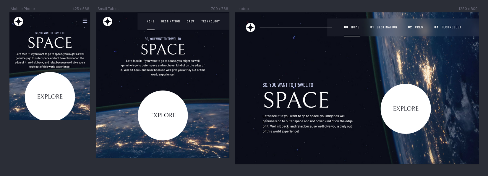
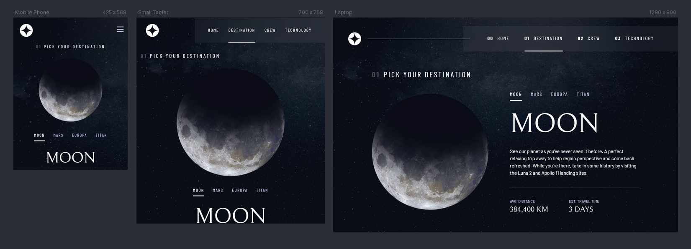

# Frontend Mentor - Space tourism website solution

## Table of contents

- [Overview](#overview)
  - [The challenge](#the-challenge)
  - [Screenshot](#screenshot)
  - [Links](#links)
- [My process](#my-process)
  - [Built with](#built-with)
  - [What I learned](#what-i-learned)
  - [Continued development](#continued-development)
  - [Useful resources](#useful-resources)
- [Author](#author)
- [Acknowledgments](#acknowledgments)

## Overview

### The challenge

Users should be able to:

- View the optimal layout for each of the website's pages depending on their device's screen size
- See hover states for all interactive elements on the page
- View each page and be able to toggle between the tabs to see new information

### Screenshot

### Links

- Solution URL: [solution-url](https://www.frontendmentor.io/solutions/responsive-space-tourism-website-FUVsabYJI2)
- Live Site URL: [space-tourism-website-url](https://space-tourism-website-coderdannie.netlify.app/)

## My process

### Built with

- Semantic HTML5 markup
- CSS custom properties
- Flexbox
- CSS Grid
- Mobile-first workflow
- ReactJs
- Styled Component
- React router(Client side rendering)

### What I learned

- I learn a lot building this project. I used react-router which makes my work faster and I also tried as much as possible to make this website responsive and accessible using various attributes and leveraging on reactJS logic and styles for the functionalities. The local data.json file provided is not working properly. The images are broken so I had to use the contents only together with the local pictures provided. I also added a 404 page as a plus

### Continued development

Areas I want to continue focusing on are basically how to consume APIs for bigger projects, responsiveness, accessibility, and best practices.

## Author

- Frontend Mentor - [@coderdannie](https://www.frontendmentor.io/profile/coderdannie)
- Twitter - [@coderdannie](https://www.twitter.com/coderdannie)

## Acknowledgments

I want to use this medium to thank my brilliant teachers/tutor @kelvin Powell and John Smilga. Making the site responsive and accessible was a big thing for me at the start so I decided to take Kelvin's course which enlighten me more on how to build this project and I learn a lot from his course as well. Am currently taking John Smilga's React course on Udemy. I have learned extensively by building an e-commerce website together with him which also motivated me to take on this frontend mentor challenge.
